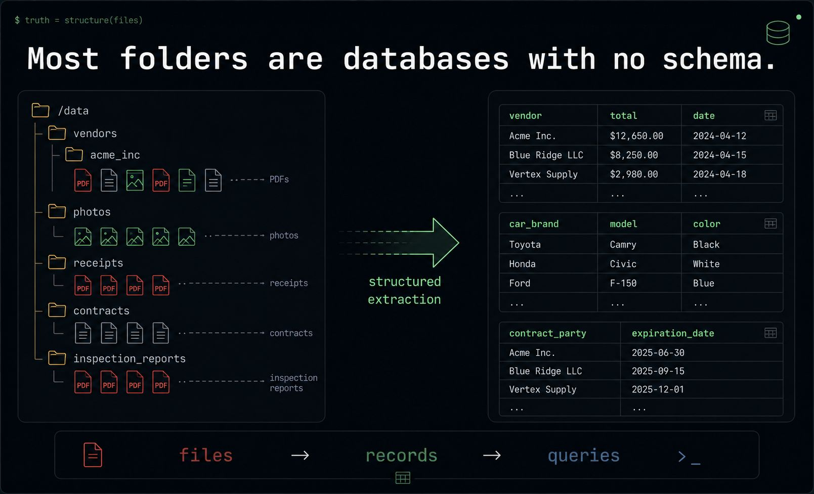

# Sifter

[](https://github.com/sifter-ai/sifter/actions/workflows/ci.yml)
[](https://codecov.io/gh/sifter-ai/sifter)
[](https://pypi.org/project/sifter-ai/)
[](https://www.npmjs.com/package/@sifter-ai/sdk)
[](https://www.python.org/)
[](https://nodejs.org/)
[](LICENSE)

**Most folders are databases with no schema.**

Open-source document intelligence engine — schema-driven extraction, NL query, MCP server, Python and TypeScript SDKs. Self-hostable under MIT.


---

## Why not RAG?

RAG is built for retrieval — *find me chunks similar to this query*. It breaks on homogeneous collections like invoices, contracts, or receipts where every document looks alike and the question is an aggregation, not a search.



Sifter's approach: extract structured fields once (*client, date, total*), store them as typed records, query with real filters and aggregations. The answer is exact and reproducible — because it's a database query, not a similarity search.

---

## Quickstart

```bash
git clone https://github.com/sifter-ai/sifter
cd sifter/code
cp server/.env.example server/.env.local    # set SIFTER_DEFAULT_API_KEY (required)
docker compose up -d
```

Open `http://localhost:3000` — create a sift, upload documents, query results.

---

## Python SDK

```bash
pip install sifter-ai
```

```python
from sifter import Sifter

s = Sifter(api_key="sk-...")

sift = s.create_sift("Invoices", "client name, date, total amount")
sift.upload("./invoices/")
sift.wait()

for record in sift.records():
    print(record["extracted_data"])
# {"client": "Acme Corp", "date": "2024-01-15", "total_amount": 1500.0}
```

## TypeScript SDK

```bash
npm install @sifter-ai/sdk
```

```typescript
import { Sifter } from "@sifter-ai/sdk";

const client = new Sifter({ apiKey: "sk-..." });

const sift = await client.createSift("Invoices", "client, date, total amount");
await sift.upload("./invoices/");
await sift.wait();

const records = await sift.records();
console.log(records);
```

---

## MCP server (Claude Desktop / Cursor / AI agents)

```json
{
  "mcpServers": {
    "sifter": {
      "command": "uvx",
      "args": ["sifter-mcp", "--base-url", "http://localhost:8000"],
      "env": { "SIFTER_API_KEY": "sk-dev" }
    }
  }
}
```

Then ask Claude: *"What's the total unpaid across all invoices from last quarter?"*

Want a remote MCP URL without running a local server? → [Sifter Cloud](https://sifter.run)

---

## What's included

- **Schema-driven extraction** — describe what to extract in natural language; schema is inferred automatically and exported as Pydantic / TypeScript types
- **NL query** — ask questions in plain language; Sifter generates inspectable MongoDB aggregation pipelines
- **MCP server** — stdio transport, read + write tools, zero custom integration code
- **REST API + SDKs** — full OpenAPI spec, typed clients for Python and TypeScript
- **Webhooks** — HMAC-signed HTTP callbacks on every extraction event
- **Spec-driven dashboards** — short NL spec → auto-generated board (KPI, breakdown, table, time series)
- **CLI** — `sifter extract`, `sifter records`, `sifter sifts` for terminal workflows and CI
- **Self-hostable** — Docker Compose, bring your own MongoDB and LLM API key

---

## Don't want to run infrastructure?

[**Sifter Cloud**](https://sifter.run) is the managed version — no Mongo, no ops, remote MCP endpoint, Google Drive and email ingress. Free tier available.

---

## Docs

Full documentation at [docs.sifter.run](https://docs.sifter.run) — quickstart, SDK reference, MCP guide, cookbook, self-hosting.

---

## License

MIT — see [LICENSE](LICENSE).

Created by [Bruno Fortunato](https://github.com/bfortunato).
